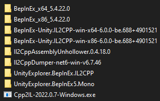

# BepInEx-deploy-script
Python script project to deploy BepInEx automatically.

## What it dows
Given PATH_TO_UNITY_GAME_DIRECTORY, NAME_OF_CSPROJ, this script will: <br />
* Detect assembly architecture (x86/x64)
* Detect unity version (like 2019.4.16)
* Detect cross-platform method (mono/il2cpp)

Then, it does: <br />
* Copy correct BepInEx folder to unity game directory.
* Run dotnet command to create a csproj template.
* Modify your csproj to reference unity assemblies, and copy to BepInEx plugin folder on build.
* If game is il2cpp, run cpp2il and il2cppinterop.

Only support windows platform.

## Who should use
You should have created BepInEx plugins mods for at least unity 2 games. <br />
You want to creates mods for more Unity games, but tired of copying BepInEx everywhere, finding architecture, unity version for creating BepInEx templates in dotnet. <br />

## Quick start
Download this repo or clone.
```
git clone git@github.com:zblcm/BepInEx-deploy-script.git
cd BepInEx-deploy-script
```
Create a directory under repo root directory.
```
mkdir toolchain
```
Get the following tools into toolchain folder you just created. Versions are not forced, except you cannot use BepInEx6 for mono. <br />
 <br />
If you have used them before, you can copy your local version. Or here is a list of links to get them: <br />
* (mono) BepInEx 5 Mono: https://github.com/BepInEx/BepInEx/releases
* (il2cpp) BepInEx 6 il2cpp: https://builds.bepinex.dev/projects/bepinex_be
* (il2cpp) CPP2IL https://github.com/SamboyCoding/Cpp2IL/releases/tag/2022.0.7
* (optional) Unity Explorer https://github.com/sinai-dev/UnityExplorer/releases (BepInEx5.Mono and BepInEx.IL2CPP)

In addition, if you are going to use il2cpp, you should [install il2cpp-interop](https://github.com/BepInEx/Il2CppInterop/blob/master/Documentation/Command-Line-Usage.md).


Then you can run python command to deploy BepInEx automatically.
```
python mypy.py "PATH_TO_UNITY_GAME_DIRECTORY" "NAME_OF_CSPROJ"
```

You can also view helps by:
```
python mypy.py -h
```
